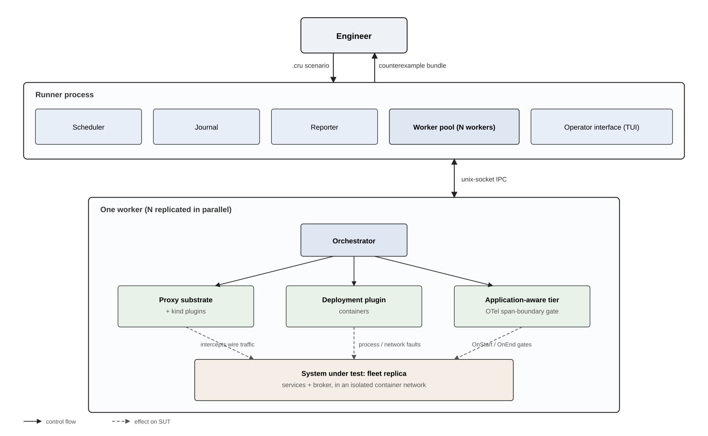
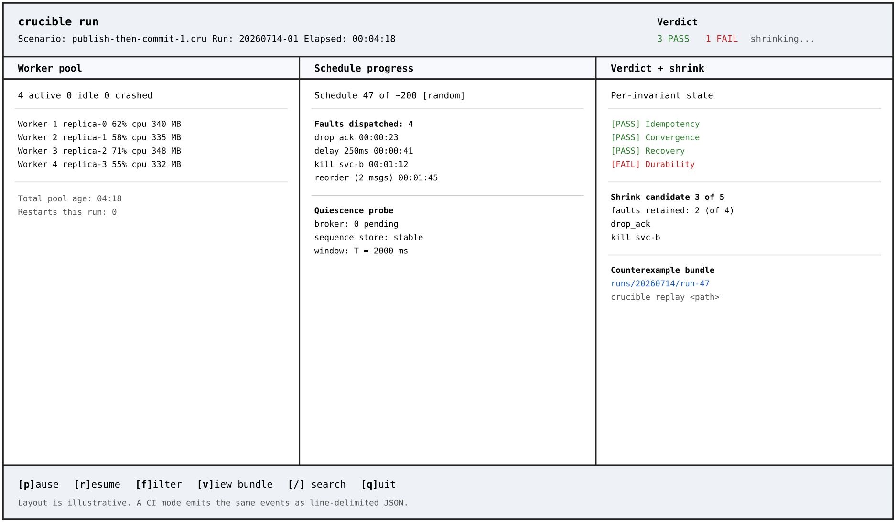

# Crucible

Property-asserted fault injection for event-driven microservices.

MSc Computer Science final project. Stuart Bruce, 2026.

## What Crucible is

Crucible is a Rust framework that drives an event-driven microservice fleet through deliberate fault schedules and tests four canonical correctness invariants against the real system: **idempotency**, **eventual consistency under reordering**, **durability**, and **recovery**. It interposes on real wire-protocol messages between services and repurposes the application's existing tracing pipeline as a fault-placement control plane, so it tests production binaries without rewriting the services under test.

## Architecture



The framework has a proxy substrate at its core and three plugin extension surfaces:

- **Kind plugins** parse the wire format of a particular protocol (HTTP, AMQP, SQL, DNS) so the proxy can act on whole logical operations rather than raw bytes.
- **Deployment plugin** owns process bring-up and network faults (initially container-shaped).
- **Application-aware tier** reaches internal moments a proxy cannot (a publish formed but not yet on the wire; a file-system commit in flight) via a per-language tracing adapter whose span-boundary callbacks fire synchronously on the calling thread.

Each worker in the pool owns an isolated system-under-test replica, so schedules can be explored in parallel without cross-run interference.

## Operator interface



The runner exposes a terminal UI for live scenario progress and post-scenario inspection. Header shows scenario identity and top-level verdict; three body panels show worker pool health, in-flight schedule progress, and the verdict state per invariant with a link to the emitted counterexample bundle. A CI mode emits the same events as line-delimited JSON rather than an interactive display.

## Implementation plan

Delivered in five slices with four milestones:

| Slice | Content |
|---|---|
| 1 | End-to-end skeleton: runner and worker process model, IPC, journal, session proxy stub, random scheduler stub |
| 2 | Minimal DSL: hand-rolled parser for `fleet`, `scenario`, and `expect` |
| 3 | AMQP plugin (core): four protocol-agnostic semantic operations (reorder, redeliver, drop, delay) |
| 4 | Directed scheduler (stretch): above the random-scheduling floor |
| 5 | Reporter and remaining invariant strategies: delta-debug shrink, replay, TUI |

Milestones: **MVP** 27 Jul 2026, **Hard gate** 31 Aug, **Soft gate** 14 Sep, **Submission** 5 Oct.

## Build

```
cargo build --workspace
cargo run -p crucible -- check examples/orders/orders.cru
cargo run -p crucible -- run examples/orders/orders.cru
```
